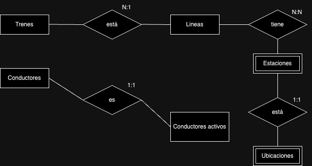
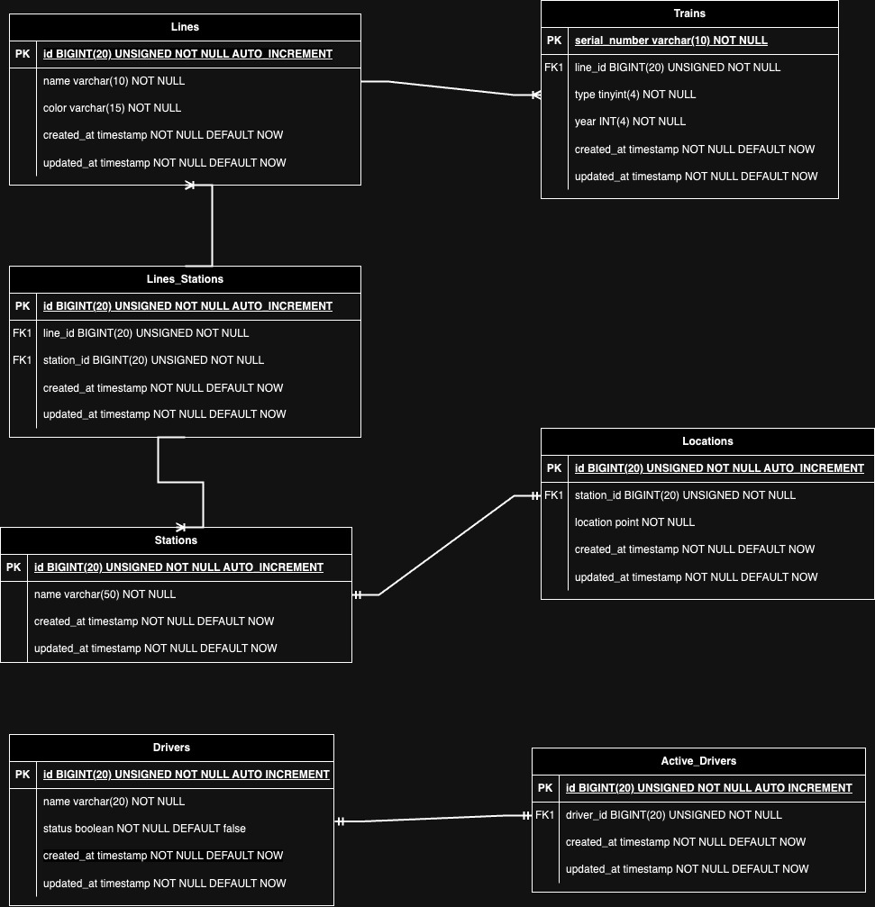

# Proyecto: Sistema de Gestión del Metro de la Ciudad de México

## Descripción

Este proyecto forma parte del curso de SQL, MySQL y MariaDB de Platzi, diseñado para proporcionar una experiencia práctica en el manejo de bases de datos relacionales. El enfoque principal de este proyecto es crear un sistema de gestión para el metro de la Ciudad de México utilizando las tecnologías mencionadas.

## Objetivos

1. **Modelado de la Base de Datos:** Diseñar y crear la estructura de la base de datos relacional que refleje de manera efectiva la complejidad y relaciones dentro del sistema del metro.

2. **Inserción de Datos Iniciales:** Implementar scripts SQL para la inserción de datos iniciales, como estaciones, líneas, horarios y otros elementos relevantes del metro.

3. **Consultas Avanzadas:** Desarrollar consultas SQL avanzadas que permitan obtener información valiosa sobre el funcionamiento del metro, como la cantidad de pasajeros, el tiempo de viaje promedio y la ocupación de las estaciones.

4. **Procedimientos Almacenados y Triggers:** Utilizar procedimientos almacenados y triggers para gestionar eventos específicos, como la actualización automática de datos cuando se añade una nueva estación o se modifica una ruta.

5. **Optimización de Consultas:** Realizar análisis y optimización de consultas SQL para mejorar el rendimiento del sistema y garantizar una respuesta eficiente.

## Tecnologías Utilizadas

- **MariaDB:** Sistema de gestión de bases de datos relacional utilizado como motor principal.
- **SQL:** Lenguaje de consulta estructurado para la manipulación y gestión de la base de datos.
- **MySQL Workbench:** Herramienta de diseño y administración de bases de datos utilizada para modelar y gestionar la base de datos.

## Diagramas de la Base de Datos

### Diagrama Conceptual

En el diagrama conceptual, se presenta una representación visual de las entidades clave y sus relaciones dentro del sistema de gestión del metro. Este diagrama proporciona una visión abstracta de la estructura de la base de datos, destacando las conexiones lógicas entre las diferentes entidades como estaciones, líneas y horarios.

### Diagrama Físico

El diagrama físico refleja la implementación concreta de la base de datos en términos de tablas, columnas, claves primarias y foráneas, así como las relaciones entre ellas. Este diagrama ofrece una visión detallada de la estructura técnica de la base de datos, permitiendo una comprensión más profunda de cómo se almacenan y organizan los datos del sistema del metro.
